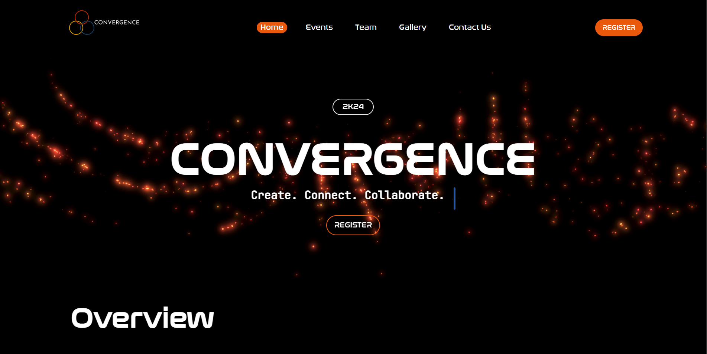
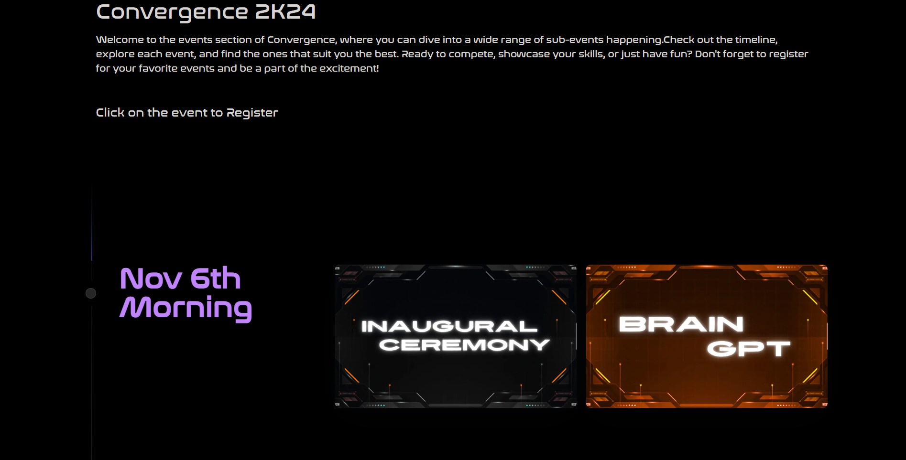

# 🎉 Convergence – Official College Fest Website

Welcome to **Convergence**, the official website for our college's flagship fest – a celebration of innovation, talent, and creativity. This website is designed to provide information, registrations, team highlights, and an immersive view of all the events hosted during the fest.


## 🚀 Features

- 🌟 Modern, responsive UI with smooth animations
- 📅 Dynamic event timeline
- 👥 Core team showcase with mobile-optimized interactions
- 📝 Online registration system (frontend ready)
- 🖼️ Carousel for event/photo highlights
- 🔗 Seamless navigation across pages


## 🧰 Tech Stack

| Category    | Tools Used                          |
|-------------|-------------------------------------|
| Frontend    | **React.js**, **TypeScript**        |
| Styling     | **Tailwind CSS**, **Framer Motion** |
| Routing     | **React Router DOM**                |
| Deployment  | **Vercel** (or similar platforms)   |


## 📂 Folder Structure

```

Convergence/
├── public/             # Static assets
├── src/
│   ├── Components/     # Reusable UI components
│   ├── fonts/          # Font for components
│   ├── assets/         # None here
│   └── page.tsx        # Main app component
├── tailwind.config.js
├── tsconfig.json
└── package.json


## 🖥️ Getting Started

To run the project locally:

```bash
# Clone the repository
git clone https://github.com/6kumaran/Convergence.git
cd Convergence

# Install dependencies
npm install

# Start development server
npm run dev
````

Now, visit `http://localhost:5173/` in your browser to see the website.

---

## 📸 Screenshots






---

## 📬 Contact

For queries or collaboration:

* 🔗 [S. Kumaran (GitHub)](https://github.com/6kumaran)
* 📧 Email: kumaran61003@gmail.com

---


---

> Built with ❤️ by the Convergence Tech Team

```

Let me know if you’d like help generating **badges**, or if you’d prefer a **dark-themed version** with markdown styling elements like code highlights, horizontal split layouts, or collapsible sections.
```
